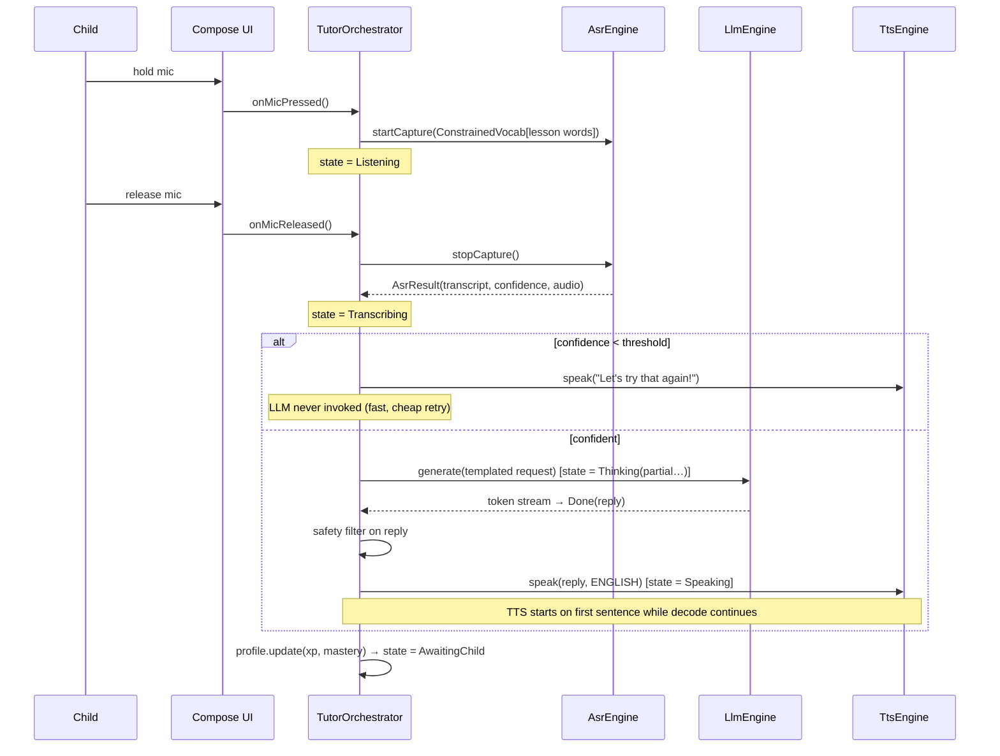
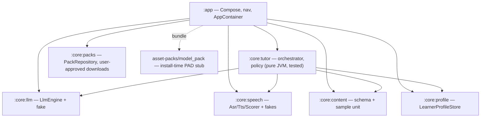
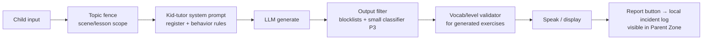

# Architecture — On-Device Language Tutor

How the scaffold in this repo maps to the production design. Everything below runs
on-device; there is no server component anywhere in the system.

## System overview

```mermaid
flowchart LR
    subgraph UI["Compose UI (:app)"]
        HOME[Home / unit map]
        LESSON[Lesson screen]
        CONV[Conversation screen]
        PARENT[Parent zone + gate]
    end

    subgraph TUTOR[":core:tutor — TutorOrchestrator"]
        SM[Turn state machine]
        POL[DialoguePolicy]
        SAFE[Safety filter chain]
    end

    subgraph ENGINES["Engine interfaces (fakes in repo → real impls in prod)"]
        ASR[AsrEngine<br/><i>Whisper/Moonshine + hotwords</i>]
        LLM[LlmEngine<br/><i>Gemma 4 E2B · LiteRT-LM</i>]
        TTS[TtsEngine<br/><i>Kokoro EN · (HE blocked on licensing)</i>]
        GOP[PronunciationScorer<br/><i>CTC-GOP, P3</i>]
    end

    subgraph DATA["Local data"]
        CONTENT[(":core:content<br/>curriculum JSON + assets")]
        PROFILE[(":core:profile<br/>learner model, local file")]
        PACK[("model_pack asset pack<br/>weights, never in repo")]
    end

    HOME & LESSON & CONV --> SM
    SM --> POL
    POL -->|RespondViaLlm| LLM
    LLM --> SAFE --> TTS
    SM --> ASR
    ASR -->|transcript + audio| POL
    ASR -.->|audio| GOP
    CONTENT --> POL
    SM --> PROFILE
    PACK -.->|mmap at load| LLM & ASR & TTS
    PARENT --> PROFILE
```

Key properties:
- **Engines behind interfaces** (`LlmEngine`, `AsrEngine`, `TtsEngine`,
  `PronunciationScorer`) with fake implementations committed — the app runs a full
  scripted tutoring turn with zero weights. `AppContainer.kt` is the single swap
  point for real engines.
- **Dual channel**: `onMicPressed/onMicReleased` (speech) and `onTextSubmitted`
  (text) converge on the same `DialoguePolicy` — the text tutor is not a separate
  product.
- **Network confined to one module** (scope update 2026-07-19): INTERNET exists
  solely for user-initiated enhancement-pack downloads via `core/packs`
  (consent dialog + manual-only update checks); no telemetry, nothing uploaded.
  The base experience never touches the network.

## A speech turn (P1 target ≤4 s p50 to first audio)



Thermal rule: engines `load()` at session start, `unload()` at session end;
nothing runs between turns. Session soft-cap (~20 min) doubles as thermal guard.

## Module graph (Gradle)



All `core:*` modules are **pure JVM** — they build and unit-test without the
Android SDK (`./gradlew -Plangtutor.jvmOnly=true build`), which is also how this
repo's sandboxed CI-less environment verifies them. The Compose app compiles in
GitHub Actions.

## Model delivery & storage

```
APK/AAB
├── base module (≤200 MB): app code, UI assets, LiteRT-LM/sherpa runtimes
├── asset-packs/model_pack (install-time, ~3.2 GB in prod):
│   └── models/
│       ├── gemma4-e2b.litertlm        2.58 GB   (LLM)
│       ├── asr-en-small.q5.bin        250 MB    (Whisper-class)
│       ├── tts-en-kokoro.int8.onnx    80 MB
│       ├── gop-phoneme-ctc.onnx       ~20 MB    (P3)  # Hebrew TTS dropped:
│       │                                # no commercially-licensed voice yet
│       │                                # (docs/feasibility.md §Hebrew TTS)
│       └── vad-silero.onnx            ~2 MB
└── content packs: units, art, pre-recorded he/en audio (300–500 MB)
```

- Files stored **uncompressed** (`androidResources.noCompress`) so engines can
  mmap them directly; Play compresses transport.
- `.gitignore` blocks all weight extensions — the repo never carries models; the
  pack ships a README with the expected layout (see `asset-packs/model_pack/`).
- Budget: ≈3.4–3.7 GB ≤ Play's ~4 GB per-device ceiling; E4B tier and Hebrew-ASR
  pack are on-demand/direct-APK extras (see feasibility §7).

## Safety layers (all offline, Play GenAI-for-kids grade)



## Hebrew/RTL implementation notes

- Resources: `values-iw/` (Android's canonical Hebrew qualifier) for strings;
  BCP-47 `he` in `locales_config.xml` and `AppCompatDelegate.setApplicationLocales`.
- `supportsRtl=true`; per-app language from minSdk 31 via AppCompat's
  `autoStoreLocales` service.
- English learning content renders inside an explicit LTR island
  (`EnglishContent {}` = `LocalLayoutDirection provides Ltr`) within the RTL
  chrome; BiDi isolates (FSI/PDI) wrap English words embedded in Hebrew strings.
- Fonts: system Noto Sans Hebrew fallback now; any custom kid font must be
  bundled (downloadable fonts are impossible forever — there's no INTERNET).
